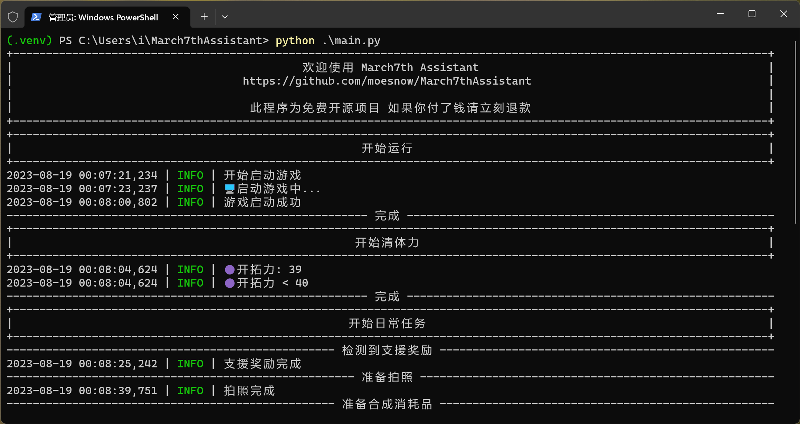
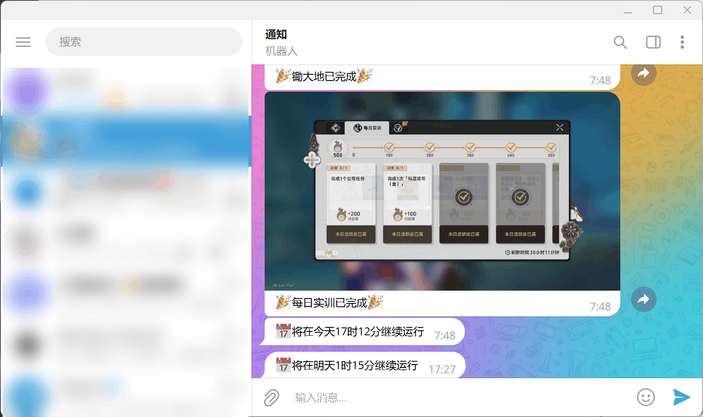

<p align="center">
    
</p>

<h1 align="center">
三月七小助手<br>
March7thAssistant
</h1>

崩坏：星穹铁道 自动日常任务｜自动忘却之庭/混沌回忆｜自动锄大地/模拟宇宙｜7×24小时运行｜消息推送

## 功能

> 锄大地和模拟宇宙功能调用的其他项目，可能涉及到开源相关的问题<br>所以在群文件内提供完整版，你也可以自己设置启动命令

自动刷副本｜借支援｜领派遣、邮件、实训等奖励｜拍照、合用材料消耗品｜锄大地、模拟宇宙、混沌回忆

详情见 [配置文件](config.yaml) 🌟喜欢就给个星星吧|･ω･) 🌟 群号 855392201

## 注意事项

- Python `3.11.4` 测试可用
- 支持 `1920*1080` 窗口或全屏
- 运行前先改配置 `config.yaml`

## 一键运行

### 集成Python环境和依赖的版本（适合小白）

前往 [releases](https://github.com/moesnow/March7thAssistant/releases) 下载，缺点是首次启动慢、体积大

如果下载缓慢可以右键复制链接后通过 [https://ghproxy.com](https://ghproxy.com) 加速

## 源码运行

克隆源代码后，双击 `one-key-run.exe` 会自动安装依赖然后启动

### 手动运行

以管理员身份打开 `cmd` 或者 `powershell`，使用 `cd` 命令进入项目根目录

```cmd
pip install -i https://mirrors.aliyun.com/pypi/simple/ -r requirements.txt
python main.py
```

```cmd
# 可选方式（使用虚拟环境）
python -m venv .venv
.venv\Scripts\activate
python -m pip install -i https://mirrors.aliyun.com/pypi/simple/ --upgrade pip
pip install -i https://mirrors.aliyun.com/pypi/simple/ -r requirements.txt
python main.py
```

## 运行截图





## 相关项目

- 模拟宇宙自动化 [https://github.com/CHNZYX/Auto_Simulated_Universe](https://github.com/CHNZYX/Auto_Simulated_Universe)

- 自动锄大地 [https://github.com/Starry-Wind/StarRailAssistant](https://github.com/Starry-Wind/StarRailAssistant)

- 星铁副驾驶 [https://github.com/LmeSzinc/StarRailCopilot](https://github.com/LmeSzinc/StarRailCopilot)