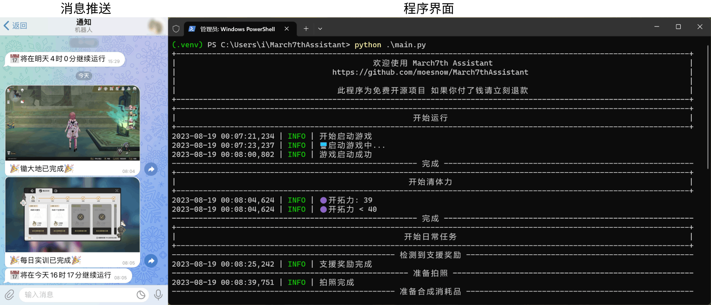

<div align="center">
  <h1 align="center">
    
    <br/>
    March7thAssistant
  </h1>
  <a href="https://trendshift.io/repositories/3892" target="_blank"></a>
</div>

<br/>

<div align="center">
🌟 点一下右上角的 Star，Github 主页就能收到软件更新通知了哦~
</div>

<div align="center">
    
</div>

<br/>

<div align="center">

**简体中文** | [繁體中文](./README_TW.md) | [English](./README_EN.md) | [日本語](./README_JA.md) | [한국어](./README_KR.md)

快速上手，请访问：[使用教程](https://m7a.top/#/assets/docs/Tutorial)

遇到问题，请在提问前查看：[FAQ](https://m7a.top/#/assets/docs/FAQ)

</div>

## 功能简介

- **日常**：清体力、每日实训、领取奖励、委托、锄大地
- **周常**：历战余响、货币战争、差分宇宙、混沌回忆、虚构叙事、末日幻影
- **云·星穹铁道**：支持后台运行、无窗口运行和 Docker 运行
- **抽卡记录导出**：支持 [UIGF](https://uigf.org/zh/standards/uigf.html)/[SRGF](https://uigf.org/zh/standards/srgf.html) 标准
- **工具箱**：自动对话、解锁帧率、兑换码
- 每日实训等任务的完成情况支持**消息推送**
- 任务刷新或体力恢复到指定值后**自动启动**
- 任务完成后**声音提示、自动关闭游戏或关机等**

详情见 图形界面设置 或 [配置文件](assets/config/config.example.yaml)｜QQ群 [点击跳转](https://qm.qq.com/q/C3IryUWCQw) TG群 [点击跳转](https://t.me/+ZgH5zpvFS8o0NGI1)  哔哩哔哩 [点击跳转](https://space.bilibili.com/3706960664857075) 

## 界面展示



## 注意事项

- 遇到错误请在 [Issue](https://github.com/moesnow/March7thAssistant/issues) 反馈，提问讨论可以在 [Discussions](https://github.com/moesnow/March7thAssistant/discussions) ，群聊随缘看
- 欢迎 [PR](https://github.com/moesnow/March7thAssistant/pulls)，提交前请先阅读 [贡献指南](CONTRIBUTING.md)

## 下载安装

前往 [Releases](https://github.com/moesnow/March7thAssistant/releases/latest) 下载后解压双击三月七图标的 `March7th Launcher.exe` 打开图形界面

## 源码运行

如果你是完全不懂的小白，请通过上面的方式下载安装，可以不用往下看了。

推荐使用 Python 3.12 或更高版本。

Windows 下如果通过终端启动，建议使用管理员模式打开 PowerShell、Windows Terminal 或 CMD；Windows 11 24H2 及以上也可以按 [Sudo for Windows](https://learn.microsoft.com/zh-cn/windows/advanced-settings/sudo/) 的方式执行。

```cmd
# Installation (using venv is recommended)
git clone --recurse-submodules https://github.com/moesnow/March7thAssistant
cd March7thAssistant
pip install -r requirements.txt
python app.py
python main.py

# Update
git pull
git submodule update --init --recursive
```

<details>
<summary>开发相关</summary>

获取 crop 参数表示的裁剪坐标可以通过小助手工具箱内的捕获截图功能

</details>

---

如果喜欢本项目，可以微信赞赏送作者一杯咖啡☕

您的支持就是作者开发和维护项目的动力🚀


---

## 相关项目

March7thAssistant 离不开以下开源项目和运行时依赖的帮助，感谢所有维护者与贡献者：

- 模拟宇宙自动化 [https://github.com/CHNZYX/Auto_Simulated_Universe](https://github.com/CHNZYX/Auto_Simulated_Universe) ：提供模拟宇宙相关能力
- 锄大地自动化 [https://github.com/linruowuyin/Fhoe-Rail](https://github.com/linruowuyin/Fhoe-Rail) ：提供锄大地相关能力
- OCR 文字识别 [https://github.com/RapidAI/RapidOCR](https://github.com/RapidAI/RapidOCR) ：提供游戏内文字识别能力
- 图形界面组件库 [https://github.com/zhiyiYo/PyQt-Fluent-Widgets](https://github.com/zhiyiYo/PyQt-Fluent-Widgets) ：提供主要界面组件与交互体验
- Mirror酱 [https://github.com/MirrorChyan/docs](https://github.com/MirrorChyan/docs) ：提供更新检查与下载分发以及 CDN 加速相关能力
- 图像处理与自动化相关依赖 `OpenCV`、`PyAutoGUI` 等：提供截图采集、图像处理与基础自动化能力
- 推理加速相关依赖 `ONNX Runtime`、`OpenVINO` ：为 OCR 和模型推理提供 CPU / GPU 加速支持

此外，`requirements.txt` 中还包含大量底层依赖，在这里不一一列出；同样感谢这些项目对本项目的支持。


## Contributors
<a href="https://github.com/moesnow/March7thAssistant/graphs/contributors">

  

</a>

## Stargazers over time

[](https://starchart.cc/moesnow/March7thAssistant)
