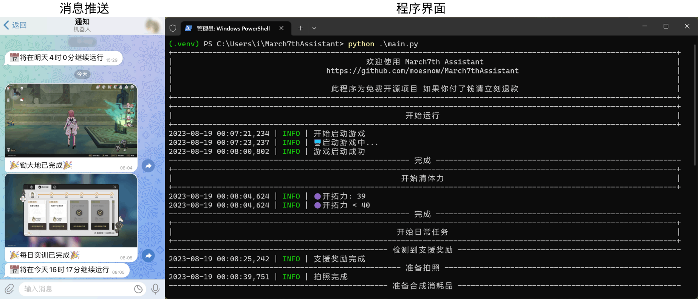

<div align="center">
  <h1 align="center">
    
    <br/>
    March7thAssistant
  </h1>
  <a href="https://trendshift.io/repositories/3892" target="_blank"></a>
</div>

<br/>

<div align="center">
🌟 Click the Star in the top-right corner to get notified about updates on GitHub!
</div>

<div align="center">
    
  </a>
</div>

<br/>

<div align="center">

[简体中文](./README.md) | [繁體中文](./README_TW.md) | **English** | [日本語](./README_JA.md)

**English version generated by ChatGPT.**

**The in-game language currently only supports Simplified Chinese.**

To get started, please visit: [Tutorial](https://m7a.top/#/assets/docs/Tutorial)

If you encounter any issues, please check the [FAQ](https://m7a.top/#/assets/docs/FAQ) before asking your questions.

</div>

## Feature Overview

- **Daily Tasks**: Stamina recovery, daily training, claiming rewards, commissions, and farming.
- **Weekly Tasks**: History of Forgotten Echoes, Currency Wars, Simulated Universe, and Forgotten Hall.
- **Gacha Record Export**: Supports [UIGF](https://uigf.org/zh/standards/uigf.html)/[SRGF](https://uigf.org/zh/standards/srgf.html) standards, **automatic dialogue**
- Push notifications for the completion of daily tasks and other tasks.
- Automatically start when tasks refresh or when stamina recovers to a specified value.
- Sound notifications upon task completion, with the option to automatically close the game or shut down the computer.

> The Simulated Universe feature utilizes the [Auto_Simulated_Universe](https://github.com/CHNZYX/Auto_Simulated_Universe) project, while farming employs the [Fhoe-Rail](https://github.com/linruowuyin/Fhoe-Rail) project.

For more details, refer to the [configuration file](assets/config/config.example.yaml) or the graphical user interface settings. | Join our QQ group [click here](https://qm.qq.com/q/C3IryUWCQw) or TG group [click here](https://t.me/+ZgH5zpvFS8o0NGI1).

## Interface Showcase



## Important Notes

- You must run the game on the **PC desktop** at a resolution of `1920*1080` in either windowed mode or full screen (HDR is not supported).
- For information related to the Simulated Universe, refer to the [project documentation](https://github.com/Night-stars-1/Auto_Simulated_Universe_Docs/blob/docs/docs/guide/index.md) and [Q&A](https://github.com/Night-stars-1/Auto_Simulated_Universe_Docs/blob/docs/docs/guide/qa.md).
- For running in the background or on multiple monitors, you can try [Remote Local Multi-User Desktop](https://asu.stysqy.top/guide/bs.html).
- If you encounter errors, please provide feedback in the [Issue](https://github.com/moesnow/March7thAssistant/issues) section. Questions and discussions can be conducted in the [Discussions](https://github.com/moesnow/March7thAssistant/discussions) section. Feel free to contribute through [PR](https://github.com/moesnow/March7thAssistant/pulls).

## Download and Installation

Go to [Releases](https://github.com/moesnow/March7thAssistant/releases/latest) and download, then extract the file. Double-click on the `March7th Launcher.exe` icon to open the graphical interface.

If you need to use the **Task Scheduler** for scheduled runs or want to execute the **Full Run** directly, you can use the `March7th Assistant.exe` from the terminal icon.

To check for updates, click the button at the bottom of the graphical interface settings or double-click `March7th Updater.exe`.

### Command Line Arguments

The GUI `March7th Launcher.exe` supports command line arguments so you can launch directly into a specific task:

```bash
# Show help
March7th Launcher.exe -h

# List all tasks
March7th Launcher.exe -l

# Launch GUI and run full workflow
March7th Launcher.exe main

# Launch GUI and run Daily Training
March7th Launcher.exe daily

# Auto-exit after task completes successfully (use with TASK)
March7th Launcher.exe main -e
```

<details>
<summary>Available Tasks</summary>

| Task | Description |
|------|-------------|
| main | Full run |
| daily | Daily Training |
| power | Spend stamina |
| currencywars | Credit Battle |
| currencywarsloop | Credit Battle loop |
| fight | Cavern farming |
| universe | Simulated Universe |
| forgottenhall | Forgotten Hall |
| purefiction | Pure Fiction |
| apocalyptic | Apocalyptic Shadow |
| redemption | Redeem codes |
| universe_gui | Simulated Universe (native GUI) |
| fight_gui | Cavern (native GUI) |
| universe_update | Simulated Universe update |
| fight_update | Cavern update |
| game | Launch game |
| notify | Test notification |

</details>

## Running from Source

If you are a complete beginner, please use the download and installation method mentioned above, and there's no need to proceed further.

We recommend using Python 3.12 or newer.

```cmd
# Installation (using venv is recommended)
git clone --recurse-submodules https://github.com/moesnow/March7thAssistant
cd March7thAssistant
pip install -r requirements.txt
python app.py
python main.py

# Update
git pull
git submodule update --init --recursive
```

<details>
<summary>Development Details</summary>

To obtain the crop parameters, which represent the cropping coordinates, you can use the screenshot capture feature in the graphical interface settings.

You can also provide parameters like "fight," "universe," "forgottenhall," etc. after running `python main.py`.

</details>

---

If you like this project, you can show your support by buying the developer a coffee☕

Your support is the driving force behind the development and maintenance of this project! 🚀


## Related Projects

March7thAssistant wouldn't have been possible without the assistance of these open-source projects:

- Automation for the Simulated Universe [https://github.com/CHNZYX/Auto_Simulated_Universe](https://github.com/CHNZYX/Auto_Simulated_Universe)

- Automation for farming [https://github.com/linruowuyin/Fhoe-Rail](https://github.com/linruowuyin/Fhoe-Rail)

- OCR Text Recognition [https://github.com/hiroi-sora/PaddleOCR-json](https://github.com/hiroi-sora/PaddleOCR-json)

- Graphic Interface Component Library [https://github.com/zhiyiYo/PyQt-Fluent-Widgets](https://github.com/zhiyiYo/PyQt-Fluent-Widgets)

## Contributors
<a href="https://github.com/moesnow/March7thAssistant/graphs/contributors">

  

</a>

## Stargazers over time

[](https://starchart.cc/moesnow/March7thAssistant)
